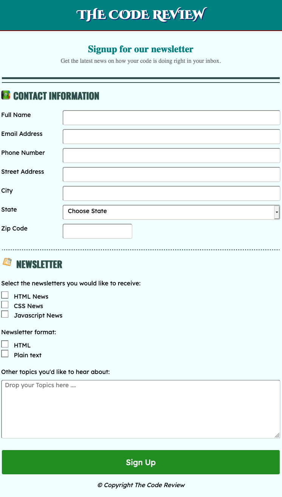

# Registration Form

## Table of contents

- [Overview](#overview)
  - [Screenshot](#screenshot)
  - [Links](#links)
- [My process](#my-process)
  - [Built with](#built-with)
  - [Tools used](#tools-used)
  - [Project Description](#project-description)
- [Author](#author)

## Overview

### Screenshot

### Links

- Solution URL: [View Code](https://github.com/Rabin92/techdegree-project3/tree/gh-pages)
- Live Site URL: [Go Live](https://rabin92.github.io/techdegree-project3/)

## My process

### Built with

- Semantic HTML5 markup
- CSS3
- [Flexbox](https://css-tricks.com/snippets/css/a-guide-to-flexbox/) - CSS Flexbox
- Mobile-first Responsive Design

### Tools used

- Visual Studio Code
- Git
- GitHub

### Project Description

For this project, I built a static responsive registration form using a variety of HTML form elements.

## Author

- Website - [Rabin Gharti Magar](https://www.rabingm.dev/)
- Frontend Mentor - [@Rabin92](https://www.frontendmentor.io/profile/Rabin92)
